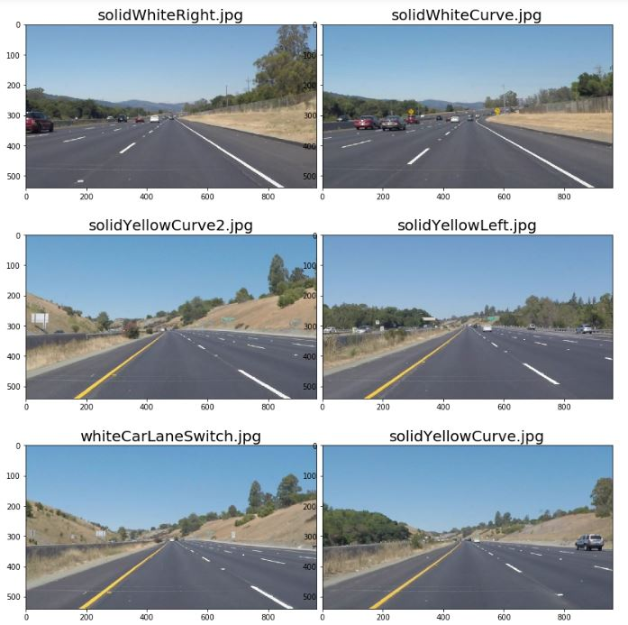
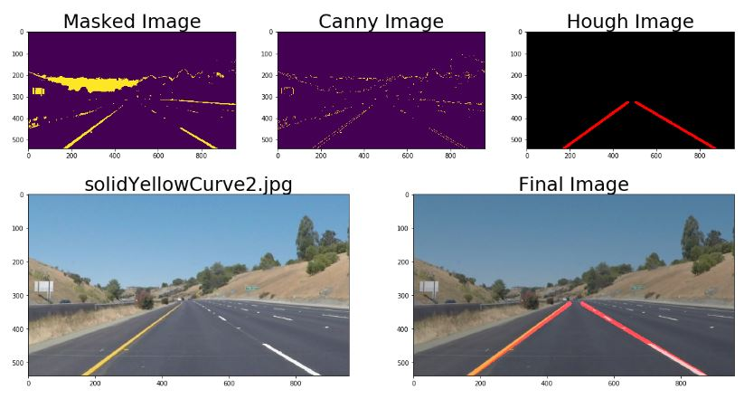

# **Finding Lane Lines on the Road** 

## Writeup Template

### You can use this file as a template for your writeup if you want to submit it as a markdown file. But feel free to use some other method and submit a pdf if you prefer.

---

**Finding Lane Lines on the Road**

The goals / steps of this project are the following:
* Make a pipeline that finds lane lines on the road
* Reflect on your work in a written report

[//]: # (Image References)

[Original Images]: ./test_image/solidWhiteCurve.jpg "Grayscale"

---

### Reflection

### 1. Describe your pipeline. As part of the description, explain how you modified the draw_lines() function.

My pipeline consisted of the following high-level steps. 

1. The image is first converted into an hsv colorspace. 

2. Using the Gaussian bur, the "white noise" in the hsv_image is reduced so that only the significant features are highlighted. 

3. The Canny() method is then applied this smoothen image to generate edges of those features. 

4. The region containing the lanes is then defined on the Canny output image. An offset value from the image's horizontal and vertical center is created. The lanes are not assumed to be symmetrical about the driver's centerline. 

5. Hough transform is applied within the binary region of interest. This function invokes drawlines(), which will take the lines from the Hough output image and classfiy them as right or left lanes based on their slopes.  Assuming a line will be extended to the bottom of the image, the line will be drawn relative to the y-min of the lines. This value is slightly offset to avoid crossing at the top. Averages of the slopes and intercepts are calculated and used to calcuate the line coordinate pairs by rearranging the slope-intercept equation. 

6. This binary line image is then imposed on the original image using weighted_img() to give the final output as shown below. 

### 2. Identify potential shortcomings with your current pipeline

1. If the lane slopes are changing too drastically, we can no longer assume the right lane is sloping negatively. 
2. If the lanes are curving to the left, we encounter the same invalid assumption. 
3. An obstacle along a target lane will be included in the region of interest and may skew the averages. 
4. Lower driver visibility due to environmental conditions e.g. raining, hailing (white particles within view and may form lines depending on the frame rate), windshield wipers, etc. 

### 3. Suggest possible improvements to your pipeline

1. Label the lines as positive or negative slopes first and then pass it through a nested conditional to determine if this is in fact a right or left lane. If there exists a line to the right of an initially classified right line within the region of interest, it will need to be appended to the "left" list. A minimum distance requirement should be estalished as to avoid picking up an adjacent pixel or one farther along the sloped line. One of the binary mask images can be used so that any non-zero 
2. Distinguish geometry of lanes from an obstacle. Alternatively, maybe one can assume an object is much thicker than the lanes. 
3. To filter out certain environmental conditions, perhaps the program can also track the direction rate at which objects are moving versus lines that are changing position or angle with each frame. Percipitation falls more or less vertically depending on the severity of the draft and can be seen at a different speed from the car's reference frame if it, too is moving at a certain velocity. 

